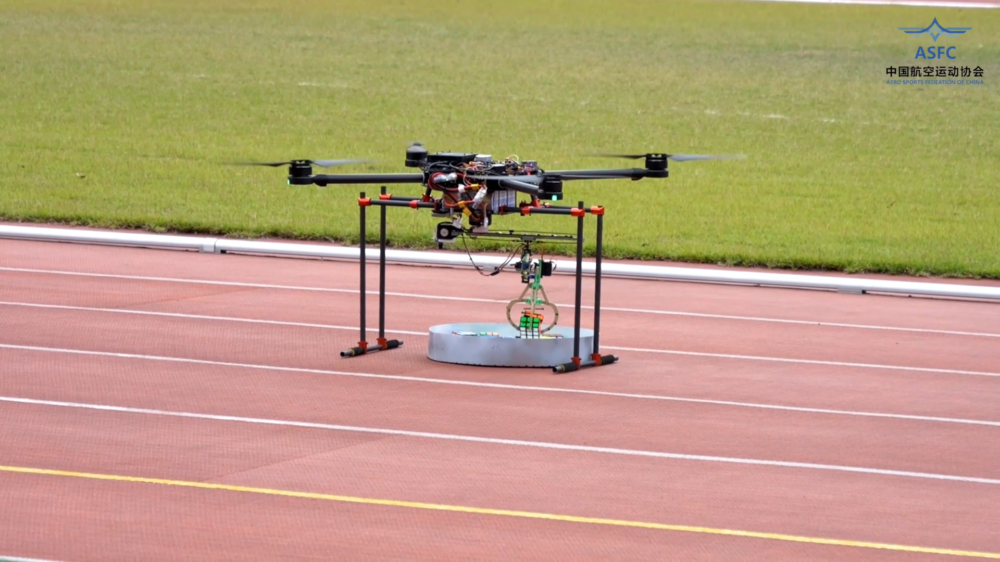

# 2024 CADC 中国国际飞行器设计挑战赛
 
> **飞行器模拟搜救系统** —— 基于 ROS2 + STM32 + Mini PC 的视觉与控制协同平台
 

 
本项目为 CADC 赛事模拟搜救任务系统，实现了飞行器控制与任务执行平台，涵盖飞机模型设计、规则系统、视觉识别与电控通信模块。

---

## 🚀 快速启动

### 📦 依赖环境

| 组件 | 版本要求 |
|------|----------|
| ROS2 | Humble |
| OpenCV | 4.x |
| Eigen | 3.x |
| Python | 3.x |
| STM32 工具链 | Keil / STM32CubeIDE（含 HAL 库） |

### 💻 ROS2 运行（Mini PC）

```bash
git clone https://github.com/gitcfyang/2024-CADC-China-Aircraft-Design-Competition-.git
cd CADC_Project
colcon build
source install/setup.bash
```

### 🧠 系统启动

```bash
# 🚀 正式任务模式
ros2 launch cadc_bringup bringup.launch.py

# 🎯 视觉调试模式
ros2 launch cadc_bringup vision_debug.launch.py
```

---

## ⚙️ STM32 端程序

STM32 负责底层执行控制，包括电机、舵机与通信协议。

**编译与烧录：**

使用 STM32CubeIDE 或 Keil，工程路径为：

```
/stm32_firmware/
```

**主要功能：**

- PWM 控制（电机 / 舵机）
- 串口通信（ROS2 → STM32）
- 状态反馈与安全保护

---

## 🧩 项目结构

```
├───Code                                 #代码文件
│   ├───Mini PC                  #ros2运行代码  
│   │   ├───src
│   │   │   ├───ac_bringup
│   │   │   ├───ac_camera
│   │   │   ├───ac_classify
│   │   │   ├───ac_solver
│   │   │   └───ac_transport
│   │   └───test
│   │       ├───include
│   │       └───src
│   └───stm32                    #stm32运行代码
│       ├───Drivers
│       │   ├───CMSIS
│       │   │   ├───Device
│       │   │   └───Include
│       │   └───STM32F4xx_HAL_Driver
│       ├───Inc
│       ├───MDK-ARM
│       │   ├───1231
│       │   ├───DebugConfig
│       │   └───RTE
│       │       └───_1231
│       ├───Middlewares
│       └───Src
└───model                                  #模型文件
    ├───Linear Actuator         #伸缩机构
    ├───otherpart               #其他部件
    └───Servo actuated claw     #机械夹爪
        ├───analysis            #仿真文件
        ├───catia               #catia模型
        ├───files
        └───images 
```

---

## ⚙️ 功能模块

| 模块 | 说明 |
|------|------|
| 🎯 视觉识别系统 | 目标检测与任务识别 |
| 📐 解算模块 | 位姿估计与任务决策 |
| 🔗 通信模块 | ROS2 ↔ STM32 串口通信 |
| ✈️ 飞行控制 | 底层电机与舵机控制 |
| 📊 规则系统 | 任务逻辑与评分规则 |

---

## 🧠 参数配置

所有参数位于：

```
cadc_bringup/config/
```

- **YAML 配置**，无需重新编译即可生效
- 参数按模块划分：`vision` / `control` / `solver`
- 修改代码后需重新执行 `colcon build`

---

## 🔄 通信说明

系统采用 ROS2 ↔ STM32 串口通信：

| 方向 | 内容 |
|------|------|
| ROS2 → STM32 | 发送控制指令（速度 / 姿态 / 任务状态） |
| STM32 → ROS2 | 执行控制 + 状态回传 |

> 协议采用自定义帧格式，建议启用 CRC 校验。

---

## 🖥️ 自启动（可选）

自启动脚本位于 `scripts/` 目录，使用方法：

```bash
chmod +x watchdog.sh
```

加入 Ubuntu Startup Applications：

1. 添加 `watchdog.sh`
2. 注意修改 ROS2 工作空间路径

---

## 📌 项目说明

本项目为赛事工程系统，结构按功能模块化设计，便于：

- ⚡ 快速调试
- 🚁 现场部署
- 🔧 参数迭代
- 🔄 模块替换

---

## 📽️ 视频与展示
 
[](比赛录像.mp4)
 
> 点击图片即可跳转播放演示视频

---

## 📄 License

本项目为赛事参赛工程，仅供学习与参考使用。
